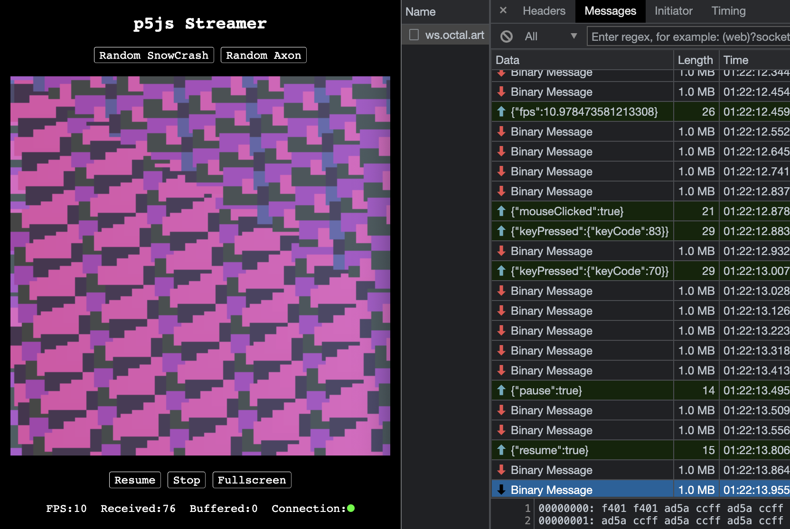

# p5js-streamer

## https://octal.art/p5js-streamer

This project renders animated p5.js art on a server, and streams pixels to clients.

A display may not have sufficient CPU to render at the desired resolution or FPS, but it can do so by offloading the `draw()` calculations to a more powerful server.

The server renders art using [p5-node](https://github.com/andithemudkip/p5-node)/[node-canvas](https://github.com/Automattic/node-canvas).  Clients connect through a WebSocket and issue commands to start, pause, resume, and stop renders.  Clients also send mouse and keyboard events, allowing the art to be interactive.

Pixel data is compressed and streamed back to clients.  The server adjusts the rendering FPS dynamically over time based on network speed and client performance.

